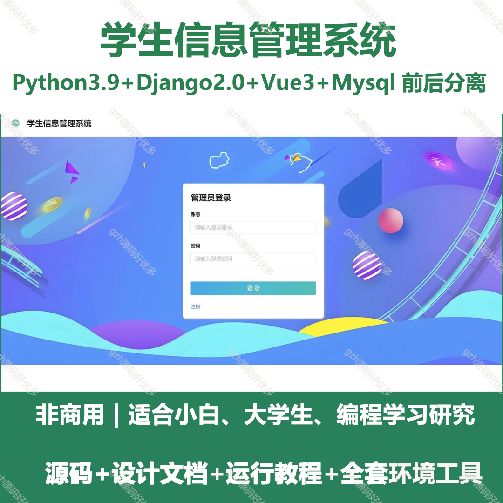
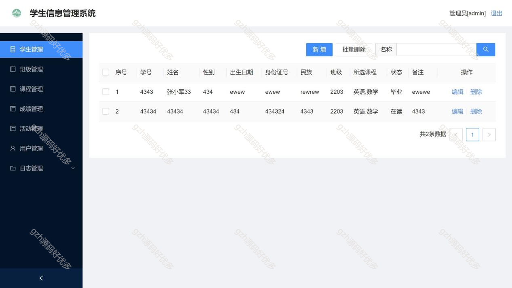
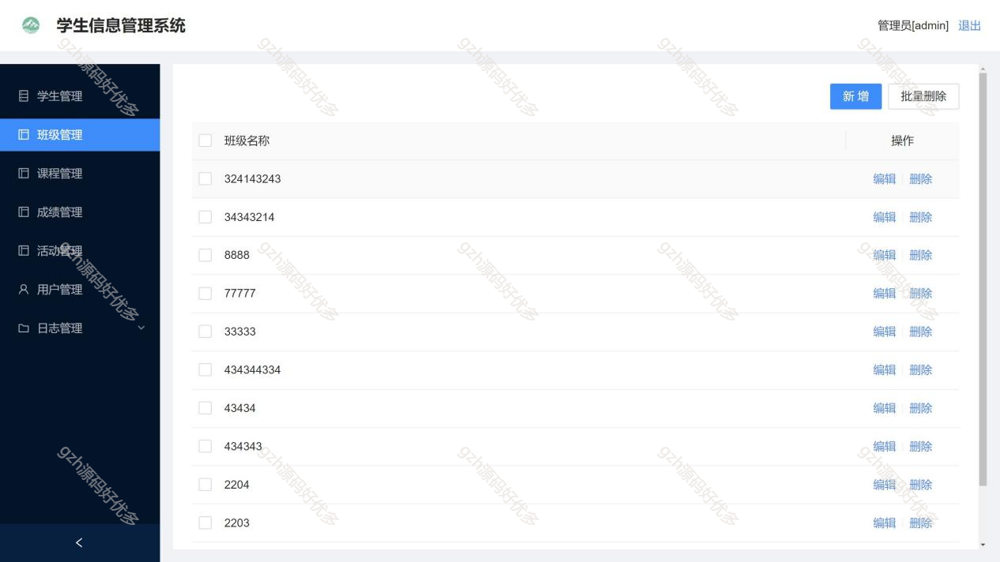
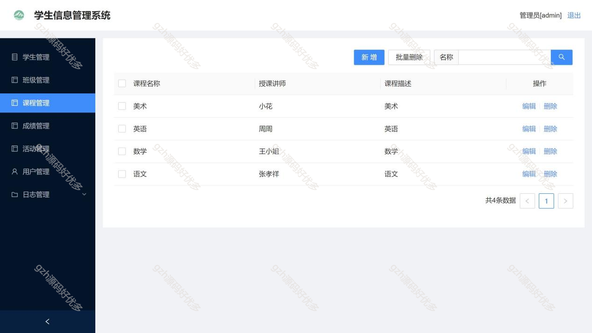
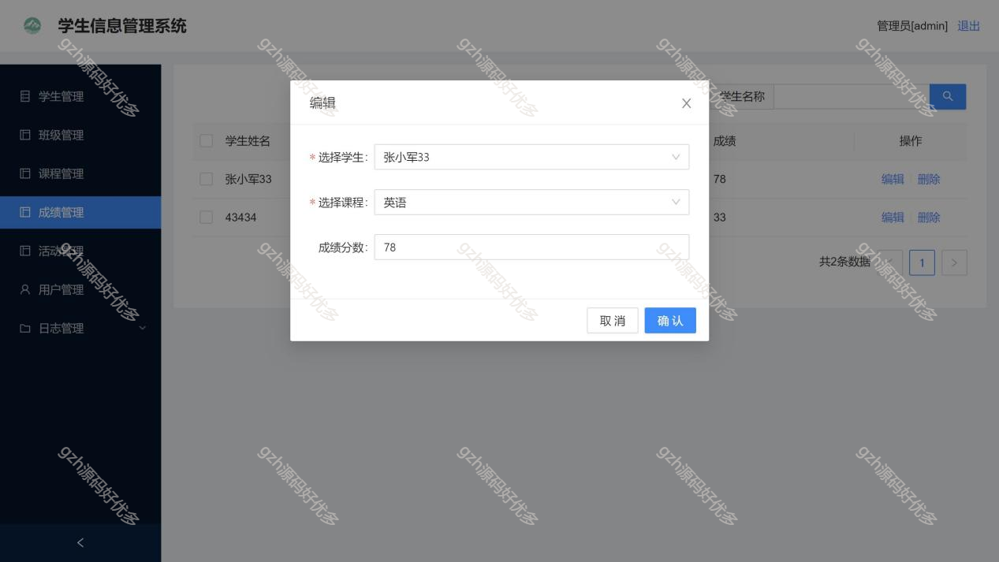
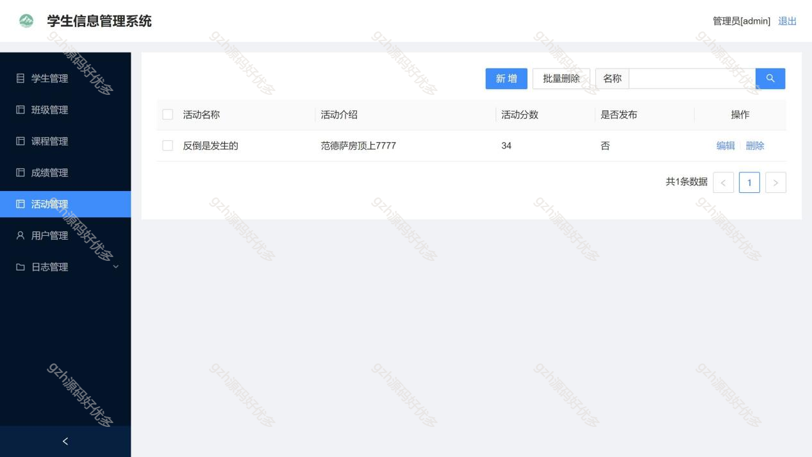
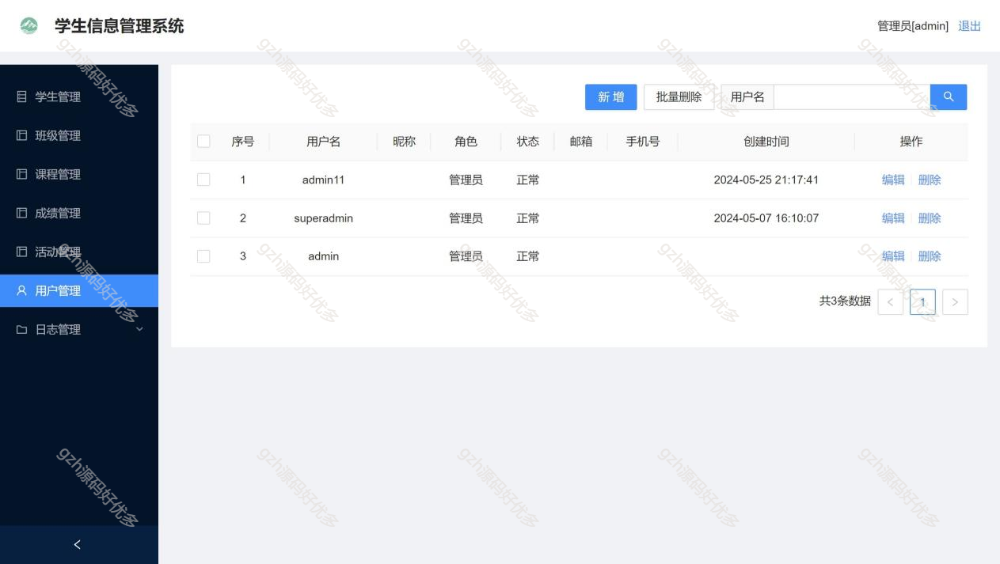
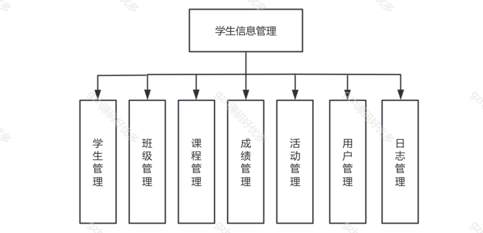
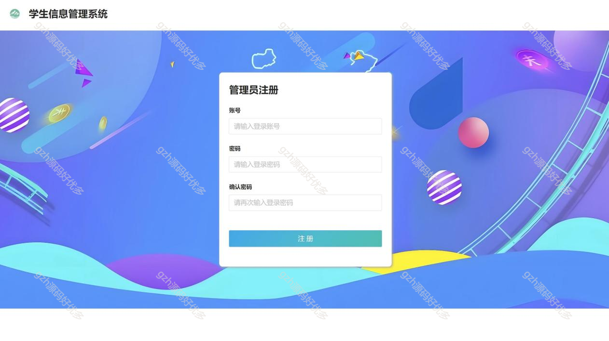

# python020
python020基于Django的学生信息管理系统
 
## 查看主页获取源码

### 一、关键词

教务系统、学生管理系统

 

### 二、作品包含

源码+数据库+设计文档+全套环境和工具资源+部署教程

 

### 三、项目技术

前端技术：Html、Css、Js、Vue3、Element-ui
后端技术：Python3.9、Django2.0

  

 

### 四、运行环境（以下版本亲测，其他版本未知，请自测）

开发工具：PyCharm + VSCODE

数据库：MySQL8

数据库管理工具：Navicat10+

Python：Python3.9

前端Nodejs：16

浏览器：谷歌浏览器

 

### 五、项目介绍

项目编号：python020

一个集可视化数据分析，信息管理等功能于一身的可供学生进行自我管理以及学校管理学生信息的学生信息管理系统。

学生信息管理系统涵盖学生、班级、课程、成绩、活动、用户及日志管理功能，实现对学生在校多维度信息的统筹管控 。

 

### 六、运行截图

